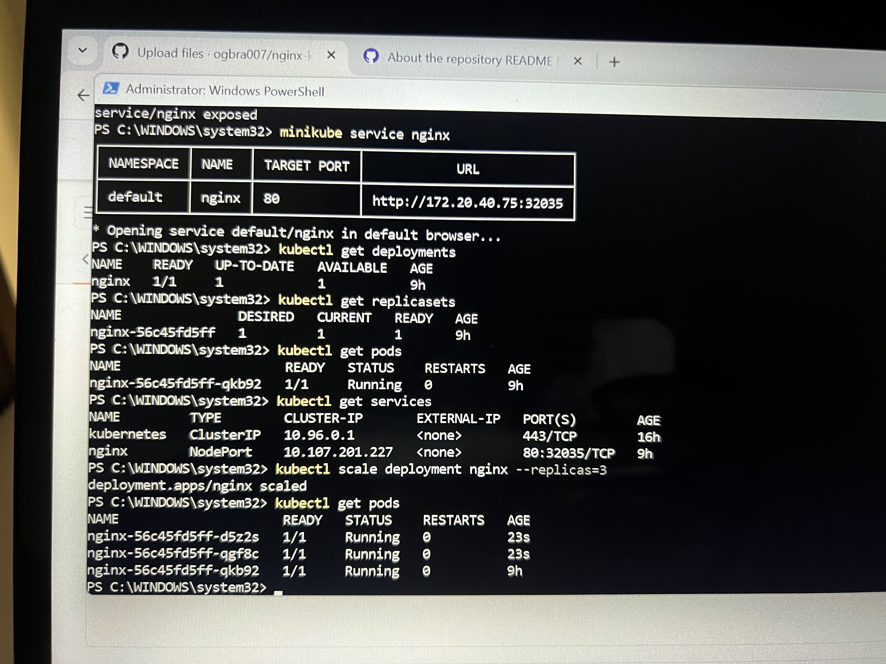
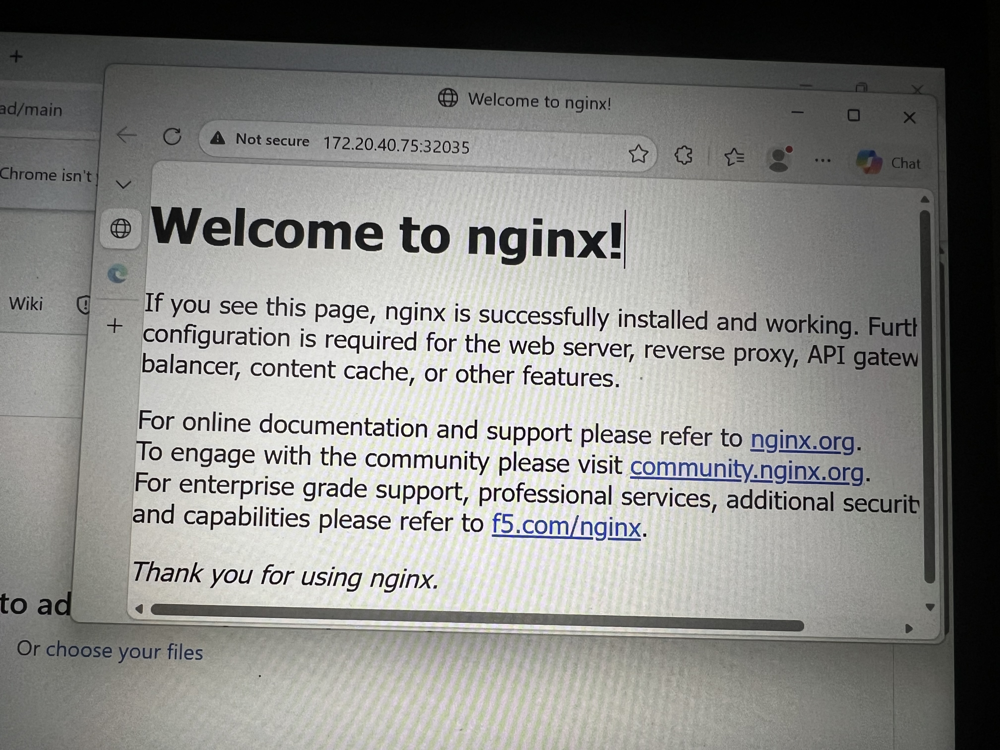

# 🚀 NGINX Deployment on Kubernetes

## 📌 Project Overview
This project demonstrates how to deploy and manage a containerized application (NGINX) using Kubernetes.

It covers key DevOps concepts such as:
- Container orchestration
- Scaling applications
- Self-healing systems

---

## 🧱 Technologies Used
- Docker (container concept)
- Kubernetes (Minikube)
- kubectl CLI
- NGINX

---

## ⚙️ What I Implemented

### 1. Created a Deployment
```bash
kubectl create deployment nginx --image=nginx
## 📸 Screenshots


